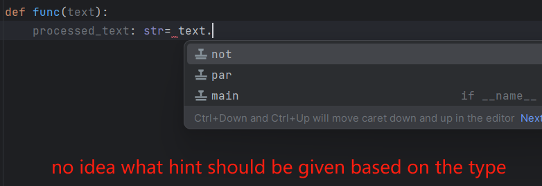
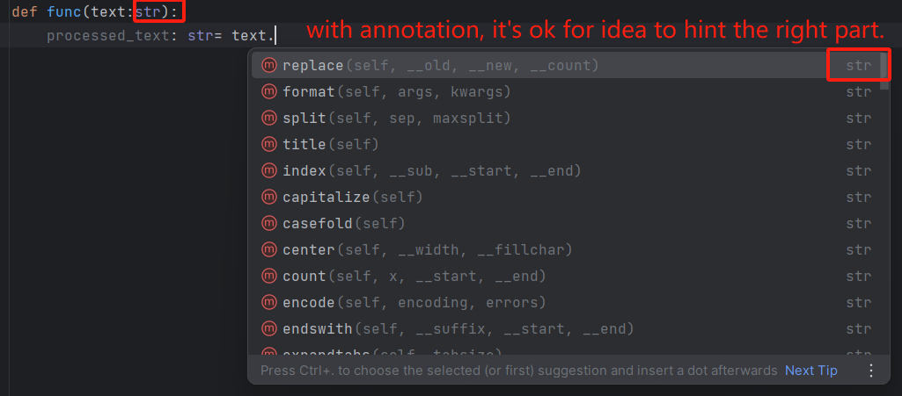

# python代码书写规范

|           主要贡献者            | 联系方式                    |  更新时间  |                  GitHub                  |
| :-----------------------------: | --------------------------- | :--------: | :--------------------------------------: |
| (Main Attributor) JamesHanZhang | `jameshanzhang@foxmail.com` | 2023-08-15 | [链接](https://github.com/JamesHanZhang) |

## 要求总结

- 要求缩进以4个空格为一组，而非制表符TAB；
- 代码长度，每行不超过79个字符，并适当使用换行符；
- 不同功能逻辑之间需有代码空格，以划分区域；
- 代码注释和文档注释说明必须正确，并优先更新；
- 源代码编码统一使用`utf-8`，或和旧文件保持一致；
- 文件名变量名规范化，仅适用英文描述；

## 命名规范
- 文件名，函数名及变量名使用蛇形命名法 `snake_case`
- 类名采用大驼峰命名法`CamelCase`；
- python没有内部变量，类似java中的`private`或者`protected`的变量在Python中不存在，所以该类变量会在命名时加入前缀下划线以示区分：`_PrivateClass`，`_private_variable`；
- 如果变量名会与python的内建方法及常量形成冲突，则在后缀名加下划线，例如`random_`，因为与常用模块`random`命名冲突，所以加入下划线后缀；
### 大驼峰命名法`CamelCase`在python中的使用
#### 类 `ClassName`
- 总是使用首字母大写单词串，如MyDay:
```python
class Person():
    pass

class EmployeeSalary():
    pass

class _PrivateCar(Car):
    """
    内部类需在命名前加下划线以示区分
    """
    pass
```
### 蛇形命名法`snake_case`在python中的使用
#### 变量
- **命名规则**：
    - public: `var_name`
    - internal：`_var_name`
    - **如与内建方法，变量冲突，则添加后缀**：`var_name_`
- 变量名全部小写，不应该带有类型信息，例如`input_dict`，其实大可不必，以免后期修改类型要大量返工；

#### 常量
- **命名规则**：
    - public: `VAR_NAME`
    - internal: `_VAR_NAME`
    - **如与常用内建变量冲突，则添加后缀**：`VAR_NAME_`
- 所有字母都大写，可用下划线分隔以增加可阅读性；

#### 函数名
- **命名规则**：
    - public: `function_name()`
    - internal: `_function_name()`
    - **如与常用内建变量冲突，则添加后缀**：`function_name_`

#### 模块名Module Name
- **命名规则**：
    - public: `module_name`
    - internal: `_module_name`
- 能不用下划线就不用下划线，但是如下划线能增加可阅读性，还是要用的；
- 需要注意的是，一些老模块仍然采用`MyModule`这种命名方式，但是现在已经不推荐；因为当一个模块名和类名相同时，我们就搞不清楚到底指的是类还是模块了。
例如，我可能会搞混，到底写的是

```python3
import StringIO
```

还是

```python3
from StringIO import StringIO
```

### 缩写 `abbreviation` -> `abr`
命名尽量使用全拼单词，但通常有两种特殊情况：
#### 常用缩写
例如XML，ID等，类的命名也只写首字母大写XmlParser等；函数及变量依然采用蛇形命名法；
#### 长单词约定俗成的缩写
例如：常见常单词缩写例举

| 长单词   | 缩写   |
| -------- | ------ |
| function | `func` |
| text     | `txt`  |
| object   | `obj`  |
| count    | `cnt`  |
| number   | `num`  | 

## Python Type in Annotation

| 类型   | 书写方式                                             | 案例            |
| ------ | ---------------------------------------------------- | --------------- |
| 整型   | `int`                                                |                 |
| 浮点型 | `float`                                              |                 |
| 字符串 | `str`                                                |                 |
| 列表   | `list[type]`，如出现多个type的可能性，内部用竖线分隔 | `list[int]`     |
| 字典   | `dict[key_type, value_type]`                         | `dict[str,int]` | 

## 变量注释
```python
# 没有什么作用，仅方便阅读以及为编译器提供合适的提示语
var: str = "hello world"
var2: int = 12
test: dict[str,str] = dict()  
test1: list[int] = [1,2,3,4,5]  
print(test1)
```

## 函数注释 function annotation
### 语法Syntax
基本的函数注释如下所示，但需注意，Python的函数数据类型的注释仅为注释，不会形成`Type Declaration`的情况，依然支持所有类型的输入；注释的作用仅为了提升代码的可阅读性，并使得编译器能给与合适的提示代码；

```python
# 类型标注及含默认值时的类型标注，-> 表示返回的类型
def foo(x: expression, y: expression = 20) -> float:
   return x+y

# 没有返回值的时候，实际上函数返回的是None，可以不写返回，也可以把返回注释为None
def foo(x: expression, y: expression = 20) -> None:
	pass

# 如有一个参数多个类型-> 用竖线注释
def foo(x: expression, y: expression = 20) -> float|int:
   return x+y
   
# 如多个返回的参数-> 表示返回的类型，则用tuple包裹
def foo(x: expression = 0.23, y: expression = 20) -> tuple[float, int]:
   return x, y

# 收集参数的类型标注
def foo(**args: expression, **kwargs: expression):
   pass
```


### 作用
- 如果没有注释，则无法弹出合适的提示代码，因为编译器本身也不知道其类型；

- 如果有注释，则可以弹出合适的提示代码；


## 函数文档 document
python没有对变量类型的声明，因此为了方便阅读，往往会在函数文档中标注各个调用的变量及返回的变量类型。也是函数的注释方法，如果已经使用前文所述的注释方法，则无需再使用以下方法。以下方法常用于python2。
```python
def addFunc(a,b):
    """
    这是一个函数文档
    :param a: int
    :param b: int
    :return: int
    """
    c=a+b
    return c

print(addFunc.__doc__)
```

